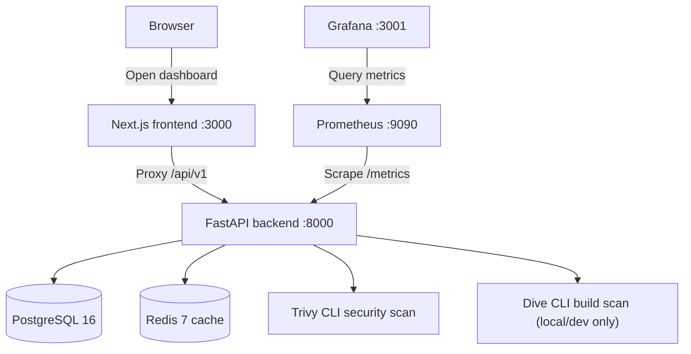
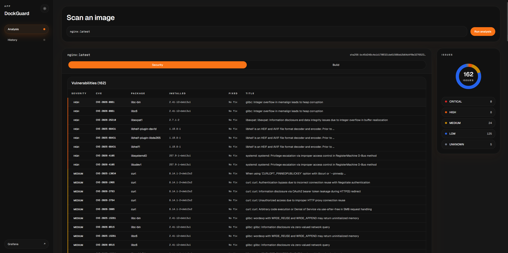
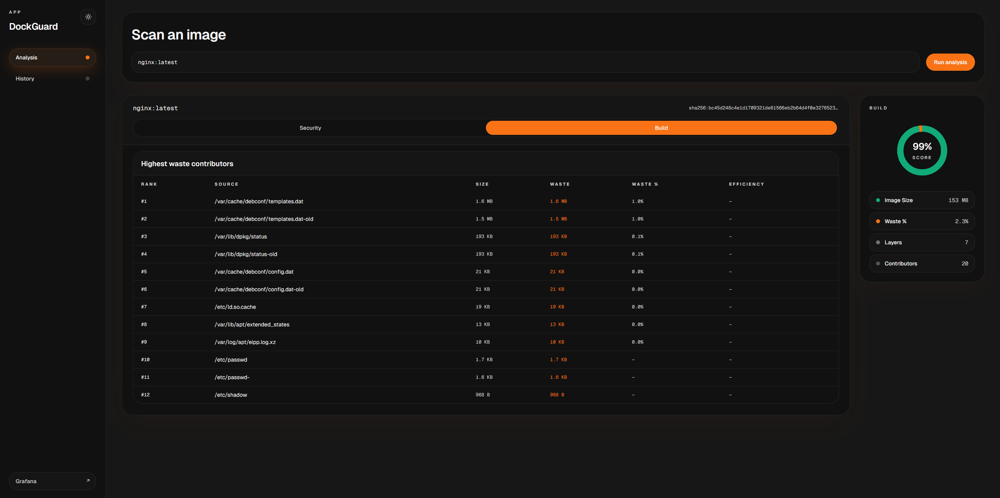
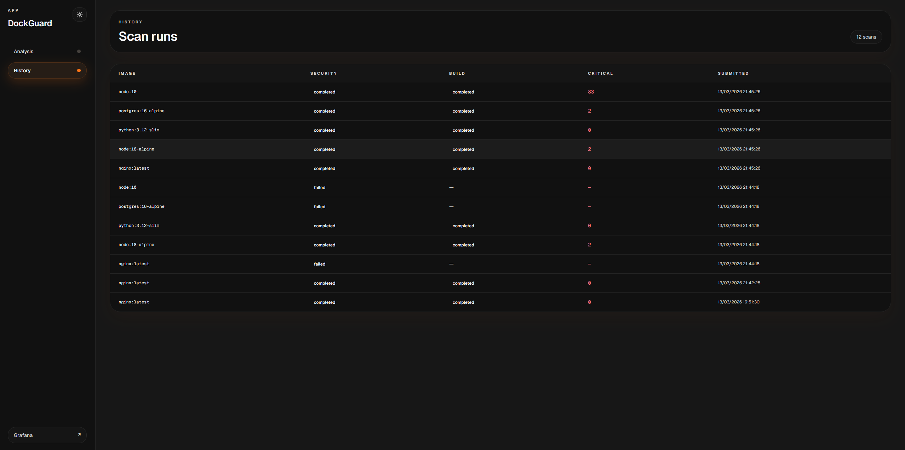

# DockGuard

[](https://github.com/acharlas/DockGuard/actions/workflows/ci.yml)
[](LICENSE)

**DockGuard** is a local-first container image analysis dashboard with two lenses: **Security** via [Trivy](https://trivy.dev) and **Build** via [Dive](https://github.com/wagoodman/dive). Paste any Docker image reference, open one scan workspace, and inspect package risk from a single `docker compose up --build`; the Build lens is available only when the backend is explicitly granted Docker socket access in local/dev.

---

## Architecture



---

## Stack

| Layer | Technology |
|-------|-----------|
| Backend | FastAPI (Python 3.12), SQLAlchemy async, Alembic |
| Frontend | Next.js 14 App Router, TypeScript, Tailwind CSS, Recharts |
| Scanner | Trivy CLI + optional Dive CLI (Build analysis only when Docker socket access is explicitly enabled) |
| Database | PostgreSQL 16 (vulnerabilities stored as JSON in `raw_report`) |
| Cache | Redis 7 (10-min TTL for digest-pinned image reuse, graceful degradation) |
| Monitoring | Prometheus + Grafana (5 custom metrics) |
| IaC | Terraform — Oracle Cloud Always Free + Cloudflare Tunnel, Terraform Cloud remote state |
| CI/CD | GitHub Actions — lint → test → build (ARM64) → security scan → push GHCR → deploy via SSH |

---

## Quick Start

```bash
git clone https://github.com/acharlas/DockGuard.git
cd DockGuard
export DOCKER_GID="$(stat -c '%g' /var/run/docker.sock)"
docker compose up --build
```

| Service | URL |
|---------|-----|
| Dashboard | http://localhost:3000 |
| Grafana | http://localhost:3001 (admin / admin) |
| Prometheus | http://localhost:9090 |

> **Cache permissions:** The Compose stack now runs a one-shot `trivy-cache-init` service that fixes ownership on the named Trivy cache volume before the backend starts. Rebuild the backend image after pulling these changes.
>
> **API access:** The backend is exposed at `http://localhost:8000` with Swagger at `http://localhost:8000/docs`. Browser API calls go through the Next.js route-handler proxy at `/api/v1/*`.
>
> **Build analysis:** The Docker Compose stack sets `ENABLE_BUILD_ANALYSIS=true` and mounts `/var/run/docker.sock` so Dive can inspect real images. Set `DOCKER_GID` to the socket group on your host before starting the stack.
>
> **Grafana sidebar link:** The Docker Compose stack bakes `http://localhost:3001` into the frontend build. For any other environment, set `NEXT_PUBLIC_GRAFANA_URL` explicitly before building the frontend image. If it is unset, the Grafana button is hidden.

### Populate demo data

```bash
./scripts/seed.sh
```

Launches scans for `nginx:latest`, `node:18-alpine`, `python:3.12-slim`, `postgres:16-alpine`, and `node:10` (deliberately vulnerable), then polls until all complete. Grafana dashboards and the scan history page will be populated with realistic data.

---

## Screenshots

> Run `./scripts/seed.sh` first to populate data.

Add screenshots to [`docs/screenshots/`](docs/screenshots/) with these filenames:

- `dashboard-security.png`
- `dashboard-build.png`
- `history.png`

| Dashboard Security | Dashboard Build | History |
|--------------------|-----------------|---------|
|  |  |  |

---

## DevSecOps Pipeline

```
push → GitHub Actions (ci.yml)
         │
         ├─ lint     ruff (Python) + ESLint (TypeScript) in parallel
         │
         ├─ test     pytest --cov-fail-under=70 + npm test in parallel
         │
         ├─ build    docker buildx (ARM64) backend + frontend
         │
         ├─ security-scan
         │           trivy image --severity CRITICAL --exit-code 1
         │           Upload SARIF → GitHub Security tab
         │
         ├─ push-registry  (main branch only)
         │           docker push ghcr.io/acharlas/dockguard-{backend,frontend}:latest
         │
         └─ deploy-app  (main branch only, after push)
                     SSH via Cloudflare Tunnel → docker compose pull && up -d

push (terraform/) → GitHub Actions (deploy.yml)
         │
         ├─ terraform plan  (on PR — posts plan to PR comment)
         │
         └─ terraform apply  (on merge to main)
```

The security gate (`--exit-code 1` on CRITICAL) means broken images never reach the registry. SARIF output makes vulnerabilities visible directly in the GitHub Security tab without any external tooling.

---

## API

| Method | Path | Description |
|--------|------|-------------|
| `POST` | `/api/v1/scans` | Initiate analysis (`202` for new/in-flight work, `200` for digest-cached completed result, may return `429` when the queue is full) |
| `GET` | `/api/v1/scans` | Paginated scan history (filters: `status`, `date_from`, `date_to`) |
| `GET` | `/api/v1/scans/{id}` | Scan detail with Security and Build sections |
| `GET` | `/api/v1/stats` | Totals, severity breakdown, build metrics, top 10 CVEs across completed scans, top 5 images |
| `GET` | `/api/v1/health` | Health check (DB, Redis, Trivy) |
| `GET` | `/metrics` | Prometheus metrics |

Direct backend docs are available in the dev stack at `http://localhost:8000/docs` and `http://localhost:8000/redoc`.

The frontend proxies browser API calls through a Next.js route handler. The repository is designed for local/demo use, not public multi-user hosting. The sample Terraform deployment is demo-only, restricts dashboard access to the same CIDR you allow for SSH, and disables the Build lens by setting `ENABLE_BUILD_ANALYSIS=false`.

If the backend restarts, any `pending` or `running` scans are reconciled to `failed` with `failure_reason = "worker_restarted"`. The app does not try to fake durable in-process jobs.

### Async scan flow

```
POST /scans → existing pending/running scan returned when duplicate work is already in flight
          ↓
          202 (scan_status: "pending")  |  200 (completed digest cache hit)
                    ↓ asyncio background task
              scan_status: "running"
                    ↓
              Trivy security analysis
                    ↓
              Dive build analysis (best effort)
                    ↓
              scan_status: "completed" | "failed" | "cancelled"
                    ↓
              completed scans persist Security + Build output on the same row
                    ↓
              Redis cache set for immutable digest → digest-pinned requests can reuse a recent completed result
```

---

## Custom Prometheus Metrics

| Metric | Type | Labels |
|--------|------|--------|
| `dockguard_scans_total` | Counter | `status` |
| `dockguard_scan_duration_seconds` | Histogram | — |
| `dockguard_vulnerabilities_found` | Counter | `severity` |
| `dockguard_build_analyses_total` | Counter | `status` |
| `dockguard_active_scans` | Gauge | — |

---

## Development

```bash
# Dev stack with hot reload
docker compose up

# Backend tests + coverage
docker compose exec backend pytest --cov --cov-report=term

# Frontend tests
docker compose exec frontend npm test

# Lint
docker compose exec backend ruff check app/ tests/
docker compose exec frontend npm run lint

# Terraform validate
cd terraform && terraform init -backend=false && terraform fmt -check && terraform validate
```

---

## Key Design Decisions

| Decision | Rationale |
|----------|-----------|
| No `Vulnerability` table | Trivy JSON stored in `raw_report`, queried via PostgreSQL JSON operators. Denormalise only when slowness is proven, not assumed. |
| One scan row stores both lenses | Security and Build are part of the same user action. A second table would be ceremony for this MVP. |
| `asyncio.Semaphore(3)` not a queue service | One line limits concurrency to 3 concurrent scan processes — zero extra infrastructure for a single-worker backend. |
| Redis added at Day 5 | Not Day 1. Added when the use case was real (reuse digest-pinned scans safely), not speculatively. |
| Flat Terraform (split by concern) | Files split by responsibility (provider, network, compute, cloudflare) without modules. Modules add abstraction cost for a single-VM deployment. |
| `templatefile()` for cloud-init | Separates HCL interpolation from YAML/bash, avoiding nested heredoc parsing issues and making the bootstrap script testable independently. |
| Build lens gated by config | `ENABLE_BUILD_ANALYSIS` keeps Docker-socket access out of demo deployments while preserving the full Build lens in local/dev Compose. |

## Deployment

Production runs on **Oracle Cloud Always Free** (ARM VM, 4 OCPU, 24GB RAM) with **Cloudflare Tunnel** for zero-trust ingress. No public HTTP ports on the VM.

| URL | Service |
|-----|---------|
| https://dockguard.acharlas.dev | Dashboard |
| https://grafana.acharlas.dev | Grafana |

### Deploy from scratch

1. Configure Terraform Cloud workspace with OCI credentials
2. Configure Cloudflare API token and zone
3. Copy `terraform/terraform.tfvars.example` to `terraform/terraform.tfvars` and fill in values
4. Push to `main` — GitHub Actions handles:
   - Image build (ARM64) → security scan → push to GHCR
   - Terraform apply (if `terraform/` changed)
   - App deploy via SSH (after images pushed)

### Notes

- SSH access restricted to `ssh_allowed_cidr` in Terraform vars
- The Build lens is disabled in production (`ENABLE_BUILD_ANALYSIS=false`). Use local/dev Compose for Docker-socket-backed Build analysis
- Grafana has anonymous read-only access enabled

---

## License

[MIT](LICENSE)
