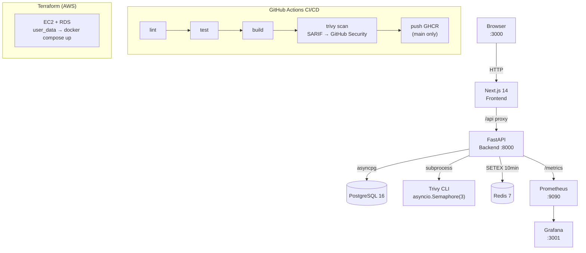

# DockGuard

[](https://github.com/acharlas/DockGuard/actions/workflows/ci.yml)
[](LICENSE)

**DockGuard** is a full-stack Docker image security scanning dashboard that wraps [Trivy](https://trivy.dev) behind a production-grade DevSecOps pipeline. Scan any Docker image, track vulnerability history, and monitor scan metrics in real time — all from a single `docker compose up --build`. The infrastructure itself is the portfolio artifact: every layer (async API, CI/CD pipeline, containerisation, Prometheus/Grafana, Terraform IaC) demonstrates a specific DevOps/DevSecOps competency.

---

## Architecture



---

## Stack

| Layer | Technology |
|-------|-----------|
| Backend | FastAPI (Python 3.12), SQLAlchemy async, Alembic |
| Frontend | Next.js 14 App Router, TypeScript, Tailwind CSS, Recharts |
| Scanner | Trivy CLI (via `asyncio.create_subprocess_exec`, never `shell=True`) |
| Database | PostgreSQL 16 (vulnerabilities stored as JSON in `raw_report`) |
| Cache | Redis 7 (10-min TTL per image tag, graceful degradation) |
| Monitoring | Prometheus + Grafana (4 custom metrics) |
| IaC | Terraform — flat `main.tf`, EC2 + RDS, `templatefile()` user_data |
| CI/CD | GitHub Actions — lint → test → build → security scan → push GHCR |

---

## Quick Start

```bash
git clone https://github.com/acharlas/DockGuard.git
cd DockGuard
docker compose up --build
```

| Service | URL |
|---------|-----|
| Dashboard | http://localhost:3000 |
| API docs (Swagger) | http://localhost:8000/docs |
| Grafana | http://localhost:3001 (admin / admin) |
| Prometheus | http://localhost:9090 |

> **First run:** The backend pre-warms the Trivy vulnerability database on startup (~50 MB download, ~1 min). Subsequent starts use the cached DB volume and are instant.

### Populate demo data

```bash
./scripts/seed.sh
```

Launches scans for `nginx:latest`, `node:18-alpine`, `python:3.12-slim`, `postgres:16-alpine`, and `node:10` (deliberately vulnerable), then polls until all complete. Grafana dashboards and the scan history page will be populated with realistic data.

---

## Screenshots

> Run `./scripts/seed.sh` first to populate data.

| Dashboard | Scan Detail | Grafana |
|-----------|------------|---------|
|  |  |  |

---

## DevSecOps Pipeline

```
push → GitHub Actions
         │
         ├─ lint     ruff (Python) + ESLint (TypeScript) in parallel
         │
         ├─ test     pytest --cov-fail-under=70 + npm test in parallel
         │
         ├─ build    docker build backend + frontend, tag with commit SHA
         │
         ├─ security-scan
         │           trivy image --severity CRITICAL --exit-code 1
         │           Upload SARIF → GitHub Security tab
         │           Pipeline fails on any CRITICAL vulnerability
         │
         └─ push-registry  (main branch only)
                     docker push ghcr.io/acharlas/dockguard-backend:latest
                     docker push ghcr.io/acharlas/dockguard-frontend:latest
```

The security gate (`--exit-code 1` on CRITICAL) means broken images never reach the registry. SARIF output makes vulnerabilities visible directly in the GitHub Security tab without any external tooling.

---

## API

| Method | Path | Description |
|--------|------|-------------|
| `POST` | `/api/v1/scans` | Initiate scan (202 Accepted, async) |
| `GET` | `/api/v1/scans` | Paginated scan history (filters: `status`, `date_from`, `date_to`) |
| `GET` | `/api/v1/scans/{id}` | Scan detail + parsed vulnerabilities |
| `GET` | `/api/v1/stats` | Totals, severity breakdown, top 10 CVEs, top 5 images |
| `GET` | `/api/v1/health` | Health check (DB ping) |
| `GET` | `/metrics` | Prometheus metrics |

Full interactive docs at `/docs` (Swagger UI) and `/redoc`.

### Async scan flow

```
POST /scans → 202 (scan_status: "pending")
                    ↓ asyncio background task
              scan_status: "running"  (Trivy subprocess starts)
                    ↓
              scan_status: "completed" | "failed"  (raw_report + summary stored)
                    ↓
              Redis cache set (10-min TTL)  →  next POST for same image returns cached result
```

---

## Custom Prometheus Metrics

| Metric | Type | Labels |
|--------|------|--------|
| `dockguard_scans_total` | Counter | `status` |
| `dockguard_scan_duration_seconds` | Histogram | — |
| `dockguard_vulnerabilities_found` | Counter | `severity` |
| `dockguard_active_scans` | Gauge | — |

---

## Development

```bash
# Dev stack with hot reload
docker compose -f docker-compose.dev.yml up

# Backend tests + coverage
docker compose -f docker-compose.dev.yml exec backend pytest --cov --cov-report=term

# Frontend tests
docker compose -f docker-compose.dev.yml exec frontend npm test

# Lint
docker compose -f docker-compose.dev.yml exec backend ruff check app/ tests/
docker compose -f docker-compose.dev.yml exec frontend npm run lint

# Terraform validate
cd terraform && terraform init && terraform validate
```

---

## Key Design Decisions

| Decision | Rationale |
|----------|-----------|
| No `Vulnerability` table | Trivy JSON stored in `raw_report`, queried via PostgreSQL JSON operators. Denormalise only when slowness is proven, not assumed. |
| `asyncio.Semaphore(3)` not a queue service | One line limits concurrency to 3 concurrent Trivy processes — zero extra infrastructure for a single-worker backend. |
| Redis added at Day 5 | Not Day 1. Added when the use case was real (avoid re-scanning the same image within 10 min), not speculatively. |
| Flat Terraform (`main.tf`) | Modules add abstraction cost. For one VPC + one EC2 + one RDS, a flat file with clear comments is easier to read and review. |
| `templatefile()` for `user_data` | Separates HCL interpolation from bash, avoiding nested heredoc parsing issues and making the bootstrap script testable independently. |
| Per-scan Trivy cache dir | Concurrent scans get isolated `fanal` (image layer) cache dirs with a symlink to the shared pre-warmed DB — eliminates file lock contention without sacrificing DB caching. |

---

## License

[MIT](LICENSE)
